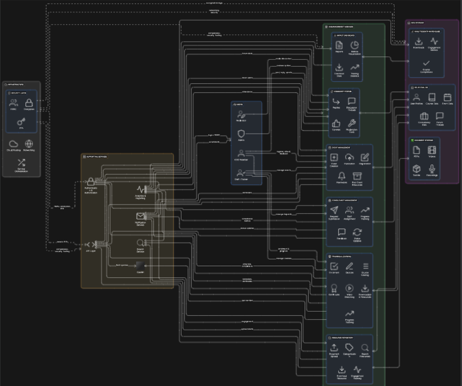

# UnganaConnect – High Level Design

## 📌 Project Overview
Ungana-Afrika supports African civil society organisations (CSOs) by providing ICT training, tools, consulting, and research.  
Currently, most of their work is done manually (email, in-person workshops, unstructured file sharing).  

**UnganaConnect** will digitise these processes to enable:
- Broader reach
- Efficient resource management
- Stronger collaboration between Ungana-Afrika and CSOs

---

## 🎯 Client Requirements
- Centralised **training portal** for CSOs
- **Knowledge repository** for toolkits, case studies, guides
- **Consultancy request system** for structured project support
- **Event & workshop management** with online registration
- **Community forum** for peer knowledge sharing
- **Impact dashboard** to measure and showcase reach

---

## 🧩 System Modules

### 0. Authentication & Administration
- Profiles  
- Login & Registration  
- Admin panel  

### 1. Training & Learning
- Course catalog & enrolment  
- Quizzes & completion certificates  
- Video streaming & downloadable resources  

### 2. Resource Repository
- Upload, categorise & search documents  
- Track downloads & engagement  

### 3. Consultancy Management
- Submit consultancy requests  
- Assign staff & track project progress  
- Status updates & feedback  

### 4. Event Management
- Publish events & workshops  
- Online registration & reminders  
- Post-event resources  

### 5. Community Forum
- Create discussion threads  
- Reply & upvote  
- Moderator tools  

### 6. Impact Dashboard
- Metrics visualisation (charts & reports)  
- Training and resource usage statistics  

---

## 🏗️ High Level Architecture

